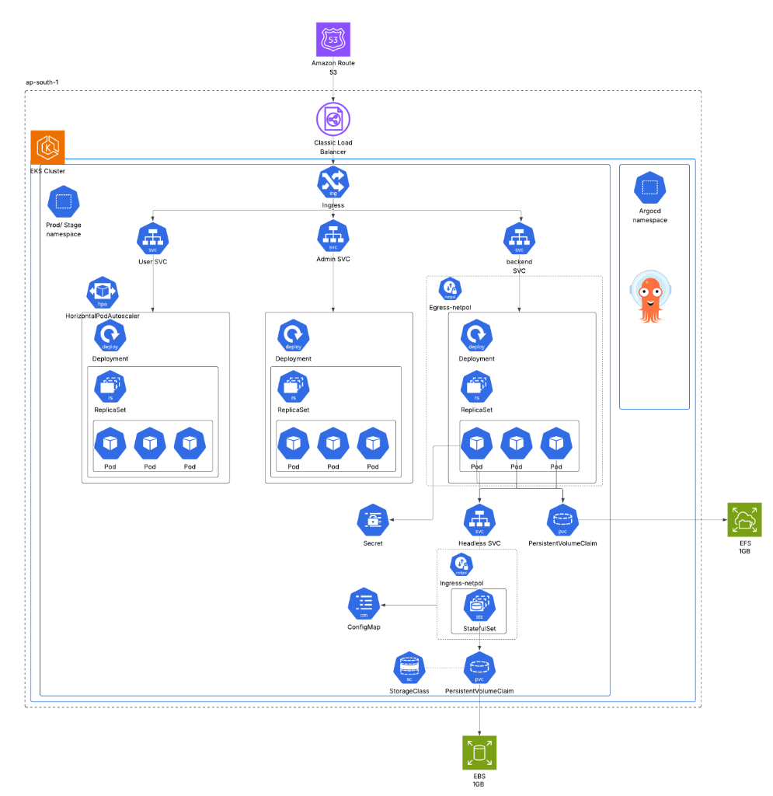
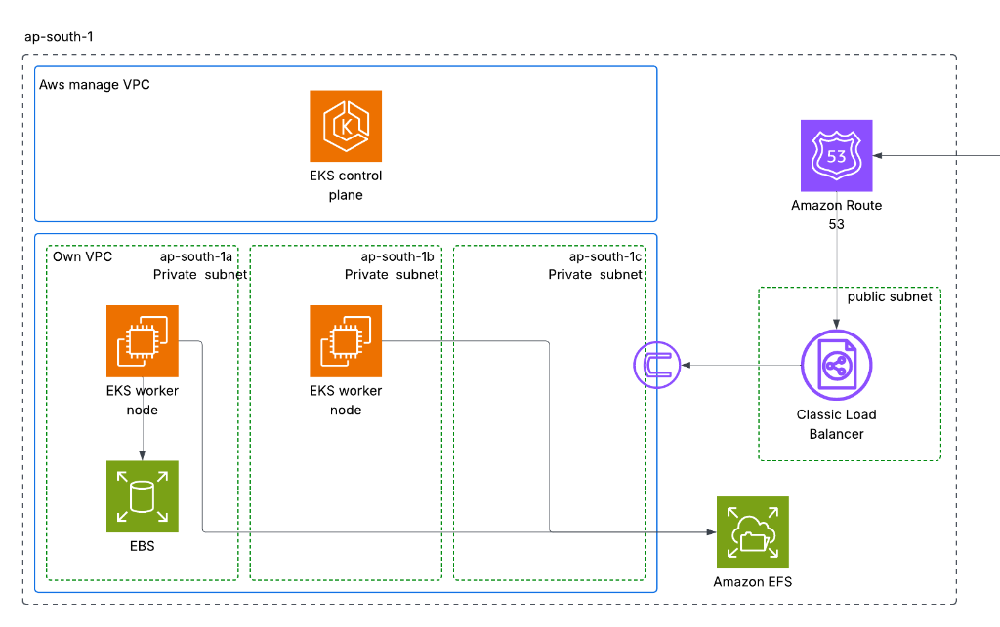
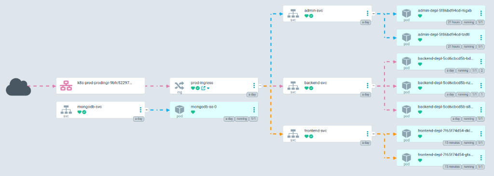

# Portfolio Website Platform (GitOps) Manifests Repository

This repository contains the Kubernetes manifests and GitOps configurations for a scalable, automated portfolio website platform. The system is designed using modern DevOps practices, leveraging AWS EKS for orchestration and Argo CD for continuous delivery.

## 🚀 Project Overview

The Portfolio Website Platform is composed of three microservices:

- **Public Frontend**: A React-based interface for visitors.
- **Backend API**: A TypeScript/Express API handling business logic and data.
- **Admin Panel**: A restricted React interface for managing content dynamically.

The entire infrastructure is provisioned using **Terraform** on AWS, and application delivery is fully automated via **GitOps** principles. Changes pushed to the application repositories trigger CI pipelines that build Docker images, while Argo CD syncs the new state to the EKS cluster, ensuring a zero-touch deployment process.

---

## 🏗 System Architecture

The architecture is designed for high availability, security, and scalability.

### Cluster Architecture



### System Workflow



### ArgoCD Application View



### Key Components

- **AWS EKS**: Managed Kubernetes service for running containerized workloads.
- **Argo CD**: GitOps continuous delivery tool that syncs the cluster state with this repository.
- **Ingress Controller**: AWS Load Balancer Controller managing ALBs for external access.
- **Storage**:
  - **EBS (gp3)**: Persistent storage for database workloads.
  - **EFS**: Shared file storage for services requiring persistence across pods.
- **Networking**:
  - **Route53**: DNS management.
  - **VPC**: Custom VPC with public/private subnets for security.

---

## 🛠 Tech Stack

### Cloud & Infrastructure

- **Cloud Provider**: AWS (EKS, VPC, Route53, IAM, EFS, EBS)
- **IaC**: Terraform
- **Containerization**: Docker
- **Orchestration**: Kubernetes (K8s)

### DevOps & CI/CD

- **GitOps**: Argo CD
- **CI Pipelines**: GitHub Actions
- **Registry**: Docker Hub / ECR (implied)

### Application Layer

- **Frontend/Admin**: React, TypeScript, TailwindCSS (inferred)
- **Backend**: Node.js, Express, TypeScript
- **Database**: MongoDB (StatefulSet)

---

## 📂 Repository Structure

This repository follows the **Kustomize** structure for managing multiple environments (Stage, Prod) with minimal duplication.

```
.
├── base/                   # Base manifests (Deployment, SVC, StatefulSet)
│   ├── admin-depl.yaml
│   ├── backend-depl.yaml
│   ├── frontend-depl.yaml
│   ├── mongodb-ss.yaml
│   └── ...
├── prod/                   # Production environment overlays (High availability)
│   ├── kustomization.yaml
│   ├── ingress.yaml
│   └── *-patch.yaml        # Image tag & replica updates
├── stage/                  # Staging environment overlays (Cost optimized)
│   ├── kustomization.yaml
│   ├── ingress.yaml
│   └── *-patch.yaml
└── other/                  # Cluster-wide resources
    ├── namespaces/         # prod, stage namespaces
    ├── pvc/                # Persistent Volume Claims
    ├── storage_class/      # gp3, efs-sc
    └── secrets_map/        # ConfigMaps & Secrets
```

---

## 🔄 Deployment Workflow

1. **Code Push**: Developer pushes code to `frontend`, `backend`, or `admin` repositories.
2. **CI Pipeline**: GitHub Actions builds the Docker image and pushes it to the registry.
3. **Manifest Update**: The CI pipeline updates the image tag in the corresponding `patch.yaml` in this repository.
4. **GitOps Sync**: **Argo CD** detects the change in this repository and automatically syncs the EKS cluster to match the new state.
